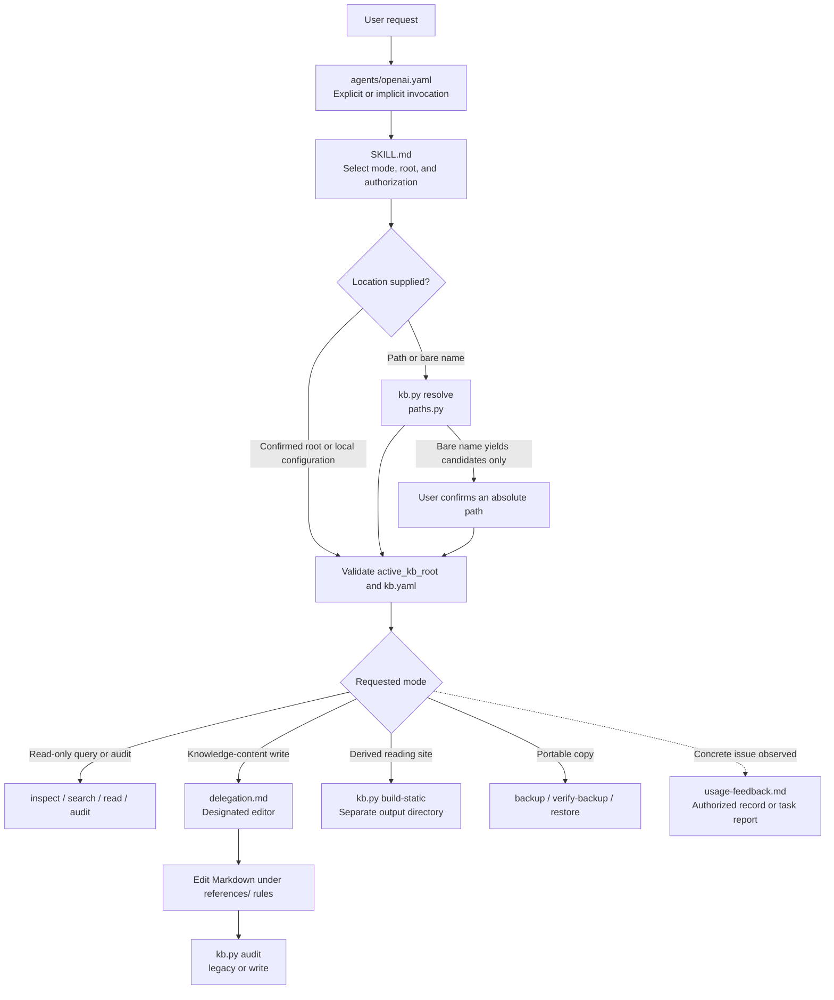
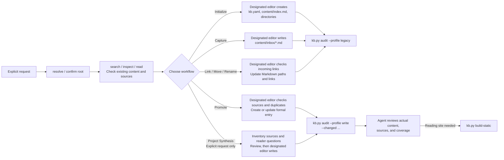
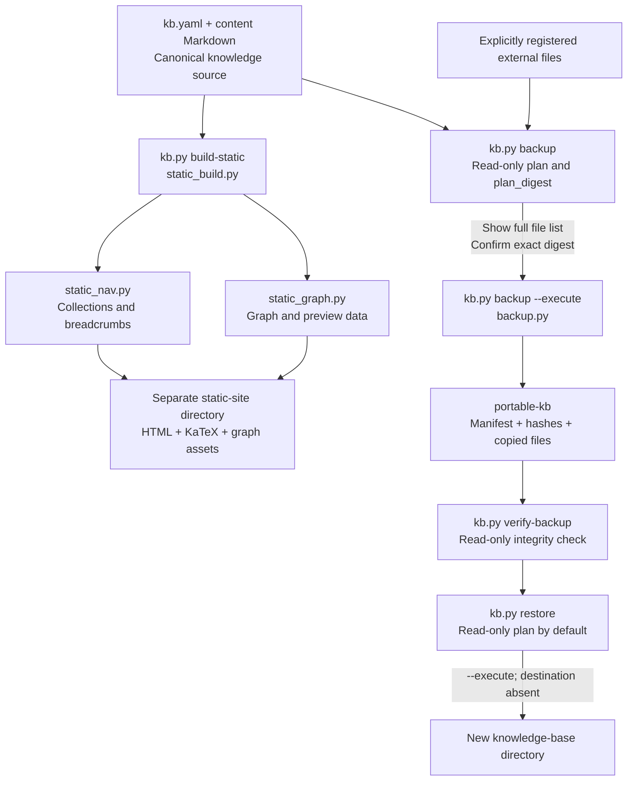
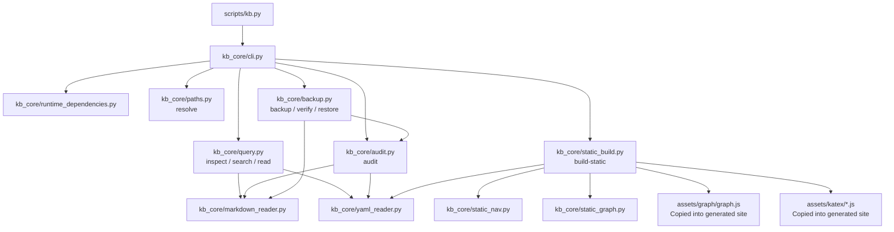

# Knowledge Base Manager: Entrypoints, Workflows, and Scripts

> Maintainer guide for the Python implementation on `main` at `b2e2a1bcec3f6bde5c0f98c07aaa7f44e6bd0eeb` (2026-09-23). The linked [`SKILL.md`](knowledge-base-manager/SKILL.md), references, and source code define behavior. Run the examples from the repository root. This document does not select or modify a real knowledge base.

## 1. Entrypoints and responsibilities

| Layer | Entrypoint | Responsibility |
| --- | --- | --- |
| Agent invocation | [`agents/openai.yaml`](knowledge-base-manager/agents/openai.yaml), [`SKILL.md`](knowledge-base-manager/SKILL.md) | Recognize an explicit or implicit request, select the mode, establish the knowledge-base root, and enforce authorization. `allow_implicit_invocation: true`. |
| Agent workflow | [`references/`](knowledge-base-manager/references/) | Define Initialize, Capture, Promote, Project Synthesis, and link maintenance. A designated editor writes Markdown directly; **these content workflows are not CLI authoring commands**. |
| Deterministic CLI | [`scripts/kb.py`](knowledge-base-manager/scripts/kb.py) → [`kb_core/cli.py`](knowledge-base-manager/scripts/kb_core/cli.py) | Dispatch nine commands: `resolve`, `inspect`, `search`, `read`, `audit`, `build-static`, `backup`, `verify-backup`, and `restore`. |



Root selection checks a path specified by the request, `CODEX_KB_ROOT`, local `knowledge-base-manager.local.yaml`, and then an established environment default. `resolve` interprets paths and bare names. A bare name produces candidates and still requires confirmation of an absolute path. Ordinary operations need a readable `kb.yaml`; initialization may use a confirmed empty directory or an authorized exact creation path. See [`initialization.md`](knowledge-base-manager/references/initialization.md).

## 2. Nine CLI commands

```text
python -X utf8 knowledge-base-manager/scripts/kb.py [--format text|json] <command> [arguments...]
```

| Command | Default effect and main arguments | Implementation |
| --- | --- | --- |
| `resolve` | Read-only; `--requested`, optionally `--project-root` and repeated `--source-root`. `--allow-missing` applies only to an authorized exact creation path. | [`paths.py`](knowledge-base-manager/scripts/kb_core/paths.py): path normalization, candidate search, containment, and reparse-path rejection. |
| `inspect` | Read-only; `--root`; list entries or inspect a page's metadata, sections, relationships, and sources. | [`query.py`](knowledge-base-manager/scripts/kb_core/query.py): manifest and structured page views. |
| `search` | Read-only; `--root --query`; filter by scope, type, and status. Ordinary search excludes archives. | [`query.py`](knowledge-base-manager/scripts/kb_core/query.py): literal phrases, snippets, and pagination. |
| `read` | Read-only; `--root --path`; whole page, section, or line range. `--expect-hash` detects a stale read. | [`query.py`](knowledge-base-manager/scripts/kb_core/query.py): bounded text reads and content-change detection. |
| `audit` | Read-only; `--profile legacy` checks basic structure. `--profile write --changed ...` also checks collection relationships for changed formal entries. | [`audit.py`](knowledge-base-manager/scripts/kb_core/audit.py): metadata, paths, links, formatting, and collection issues; reporting does not authorize repair. |
| `build-static` | Writes to a **separate output directory**; `--root --destination`; incremental by default. Use `--force` only when a full rebuild is requested. | [`static_build.py`](knowledge-base-manager/scripts/kb_core/static_build.py), with `static_nav.py` and `static_graph.py`: HTML, offline assets, and incremental manifest. |
| `backup` | Read-only plan by default; `--root --destination`. Execution needs `--execute --confirmed-plan-digest <exact digest>`. | [`backup.py`](knowledge-base-manager/scripts/kb_core/backup.py): `ReferenceComplete` file list, hashing, drift checks, staging, verification, and publication. `ProjectSnapshot` blocks. |
| `verify-backup` | Read-only; `--bundle`. | [`backup.py`](knowledge-base-manager/scripts/kb_core/backup.py): manifest, exact file set, hashes, portable links, and copied-KB audit. |
| `restore` | Read-only plan by default; `--bundle --destination`. `--execute` requires a destination that does not exist. | [`backup.py`](knowledge-base-manager/scripts/kb_core/backup.py): verified `Portable` staging and publication. `Relink` blocks. |

Except for `resolve`, dispatch loads bundled dependencies through [`runtime_dependencies.py`](knowledge-base-manager/scripts/kb_core/runtime_dependencies.py). [`model.py`](knowledge-base-manager/scripts/kb_core/model.py) defines common diagnostics and result envelopes. [`python-tools.md`](knowledge-base-manager/references/python-tools.md) specifies exact arguments, statuses, and exit codes.

## 3. Agent workflows for knowledge content



- **Initialize:** [`initialization.md`](knowledge-base-manager/references/initialization.md) creates `kb.yaml` and the entry page in an authorized empty location. `resolve` only identifies a location; **there is no `init` CLI**. Inventory a nonempty directory and agree on a migration map first.
- **Search:** [`workflows.md`](knowledge-base-manager/references/workflows.md) uses `search` → `inspect` → `read`; `rg` can assist with raw regular expressions. Do not search archives unless history is requested.
- **Capture:** Preserve the observation, context, and source in `content/inbox/` with minimal classification; then run a `legacy` audit. Capture does not automatically trigger Promote or Project Synthesis.
- **Promote:** Search for duplicates and check authorized sources. The designated editor follows [`knowledge-model.md`](knowledge-base-manager/references/knowledge-model.md), [`knowledge-writing.md`](knowledge-base-manager/references/knowledge-writing.md), and [`markdown-format.md`](knowledge-base-manager/references/markdown-format.md), adds an appropriate collection link, and normally archives processed inbox material. Run a `write` audit and review the actual prose; a clean structural audit does not establish semantic completeness.
- **Project Synthesis:** Invoke [`project-synthesis.md`](knowledge-base-manager/references/project-synthesis.md) only on explicit request. A read-only assessment stops with a report. A writing batch inventories authorized sources and reader questions, decides `UPDATE`, `LINK/COEXIST`, `NEW`, `CONFLICT`, or `NO-WRITE`, and uses a designated editor, primary-agent review, and independent read-only review for material claims. An accepted batch may receive one static build; it creates no background aggregator.
- **Link / Move / Rename:** Find incoming links, preserve permanent IDs, update affected relative links without overwriting a target, then recheck links and audit.
- **Write isolation:** [`delegation.md`](knowledge-base-manager/references/delegation.md) governs content writes. The primary agent determines authorization and scope, then reviews edits and audit results. `kb.py` does not author prose for an agent.

The canonical knowledge source is `kb.yaml` plus Markdown under `content/`. [`knowledge-model.md`](knowledge-base-manager/references/knowledge-model.md) explains `index.md`, `inbox/`, `maps/`, `knowledge/`, `sources/`, `decisions/`, `projects/`, and `archive/`. Machine-local default-root configuration belongs outside the synchronized knowledge base.

## 4. Static reading, backup, and restore



The static site is disposable output outside the live knowledge base. [`static-site.md`](knowledge-base-manager/references/static-site.md) documents incremental `.kb-static-manifest.json`, offline KaTeX, [`assets/graph/`](knowledge-base-manager/assets/graph/) browser scripts, and `kb-navigation.html`. Building a site neither audits nor edits source Markdown.

[`backup-restore.md`](knowledge-base-manager/references/backup-restore.md) requires a read-only plan, display of every source path and its digest, then execution with that exact confirmed digest. Drift requires a new plan and confirmation. Backup recursively collects knowledge-base content; external project files require individual registration. `verify-backup` checks a bundle independently. `restore` plans first and publishes only to an absent destination. The backup-plan protocol is schema 2; the bundle manifest remains schema 1. `ProjectSnapshot` and `Relink` remain unimplemented.

## 5. Script responsibilities

### 5.1 Module relationships

Arrows show dispatch or major dependencies; ordinary standard-library calls and common `model.py` types are omitted.



### 5.2 First-party Python files in the distributed Skill

| File | Responsibility | I/O boundary |
| --- | --- | --- |
| [`scripts/kb.py`](knowledge-base-manager/scripts/kb.py) | CLI entrypoint: adds its directory to Python's module path, suppresses `.pyc` output, and calls `kb_core.cli.main()`. | Does not author knowledge; effects depend on the command. |
| [`kb_core/__init__.py`](knowledge-base-manager/scripts/kb_core/__init__.py) | Defines the package and internal `__version__`; not a standalone command. | No KB I/O. Internal and README product versions differ. |
| [`kb_core/cli.py`](knowledge-base-manager/scripts/kb_core/cli.py) | Defines nine commands, arguments, text/JSON output, dependency loading, dispatch, diagnostics, and exit codes. | Lower modules perform permitted backup, restore, and static-site writes. |
| [`kb_core/runtime_dependencies.py`](knowledge-base-manager/scripts/kb_core/runtime_dependencies.py) | Checks the vendor manifest and entrypoints; loads bundled PyYAML, markdown-it-py, mdit-py-plugins, and mdurl; rejects conflicting preloaded packages. | Used except for `resolve`; no downloads, installation, or knowledge writes. |
| [`kb_core/model.py`](knowledge-base-manager/scripts/kb_core/model.py) | Defines `Diagnostic`, `Issue`, `Envelope`, `Page`, `Section`, link, source, and relationship structures. | In-memory contracts, no file I/O. |
| [`kb_core/paths.py`](knowledge-base-manager/scripts/kb_core/paths.py) | Resolves paths and bare-name candidates; provides normalization, containment, relative-link decoding, enumeration, and symbolic-link/junction rejection. | `resolve` is read-only; other modules reuse path-safety functions. |
| [`kb_core/yaml_reader.py`](knowledge-base-manager/scripts/kb_core/yaml_reader.py) | Reads and validates `kb.yaml` and Markdown frontmatter through a restricted YAML loader. | Read-only parser used by query, audit, and static build. |
| [`kb_core/markdown_reader.py`](knowledge-base-manager/scripts/kb_core/markdown_reader.py) | Parses tokens, sections, links, math, and external-source declarations while preserving locations and support text; excludes code examples from control fields. | Read-only parser; does not generate knowledge prose. |
| [`kb_core/query.py`](knowledge-base-manager/scripts/kb_core/query.py) | Implements `inspect`, literal-phrase `search`, and whole-page/section/line-range `read` with hash binding. | Read-only; stale reads return `CONTENT_CHANGED`. |
| [`kb_core/audit.py`](knowledge-base-manager/scripts/kb_core/audit.py) | Implements `legacy`/`write` checks of manifests, metadata, IDs, paths, links, format, orphan entries, parents, and cycles. | Read-only reports; also checks copied KBs during backup/restore. |
| [`kb_core/static_build.py`](knowledge-base-manager/scripts/kb_core/static_build.py) | Renders HTML and directory pages, rewrites links, embeds controls, copies KaTeX/graph assets, and maintains `.kb-static-manifest.json` for incremental output and owned-file cleanup. | Writes only to a separate site directory; preserves unrelated files. |
| [`kb_core/static_nav.py`](knowledge-base-manager/scripts/kb_core/static_nav.py) | Builds collection navigation, parent/child relationships, breadcrumb models, and digests from `kb-nav:children`. | In-memory model; no direct source or site writes. |
| [`kb_core/static_graph.py`](knowledge-base-manager/scripts/kb_core/static_graph.py) | Builds graph nodes, edges, previews, and heading anchors; serializes graph/preview JavaScript data. | In-memory data written by `static_build.py` under site `_assets/graph/`. |
| [`kb_core/backup.py`](knowledge-base-manager/scripts/kb_core/backup.py) | Plans `ReferenceComplete` with schema 2 digest, validates sources and drift, hashes and stages copies, verifies schema 1 bundles, and performs `Portable` restore. | Plans and `verify-backup` are read-only; explicit execution writes backup or restore output without modifying live KB bytes. |

### 5.3 Browser scripts and third-party assets

| File or location | Responsibility | Origin and boundary |
| --- | --- | --- |
| [`assets/graph/graph.js`](knowledge-base-manager/assets/graph/graph.js) | First-party offline SVG graph control: homepage, article overlay, standalone navigation, expansion, focus, zoom, drag, preview, keyboard, and English/Chinese UI. | Copied into the site and run in the browser; styles live in [`graph.css`](knowledge-base-manager/assets/graph/graph.css). No Python call or Markdown edit. |
| [`assets/katex/katex.min.js`](knowledge-base-manager/assets/katex/katex.min.js) | Offline TeX typesetting. | Bundled third-party KaTeX 0.18.1; no CDN. |
| [`assets/katex/contrib/auto-render.min.js`](knowledge-base-manager/assets/katex/contrib/auto-render.min.js) | Scans supported math delimiters and invokes KaTeX. | Third-party display asset; see [`THIRD_PARTY.md`](knowledge-base-manager/assets/katex/THIRD_PARTY.md). |
| Inline scripts generated by `static_build.py` | Article table of contents and code-copy interaction. | Source lives in the HTML template; there are **no separate runtime TOC/copy `.js` files**. Node tests extract the real scripts. |

The four bundled Python packages under `vendor/` are third-party distribution content, not separate Skill commands. `runtime_dependencies.py` loads them under [`manifest.json`](knowledge-base-manager/vendor/manifest.json); see [`vendor/THIRD_PARTY.md`](knowledge-base-manager/vendor/THIRD_PARTY.md).

### 5.4 Maintenance and CI scripts

| File | Responsibility | Boundary |
| --- | --- | --- |
| [`tools/vendor_dependencies.py`](tools/vendor_dependencies.py) | `--check` verifies vendor files offline; `--fetch` downloads locked artifacts; `--rebuild` regenerates a candidate from local cache; `--refresh` queries PyPI and creates a candidate tree. | Maintainer tool, not an end-user command. Fetch/refresh use the network; rebuild/refresh need explicit source and output directories. |
| [`.github/workflows/tests.yml`](.github/workflows/tests.yml) | Runs Windows/Ubuntu × Python 3.12/3.14 on push/PR; checks vendor integrity, reproducible rebuild, isolated distribution, and the full test gate. | CI only; Node 22 serves development tests, not Skill runtime. |

### 5.5 Tests and support scripts

These run during development/CI, normally against temporary fixtures rather than a real personal knowledge base.

| File | Responsibility |
| --- | --- |
| [`tests/run-all-tests.py`](tests/run-all-tests.py) | Runs eight Python suites and three Node suites, checks counts and skips, and rejects active PowerShell files/calls. |
| [`tests/python_test_report_runner.py`](tests/python_test_report_runner.py) | Wraps `unittest` scripts and reports counts, failures, and skips to the combined gate. |
| [`tests/node_test_report.cjs`](tests/node_test_report.cjs) | Wraps Node assertions and reports counts and completion. |
| [`tests/kb_python_test_support.py`](tests/kb_python_test_support.py) | Shared paths, temporary KB fixtures, and test helpers; not a user CLI. |
| [`tests/test-kb-python-parser.py`](tests/test-kb-python-parser.py) | YAML, Markdown, and path-safety cases. |
| [`tests/test-kb-python-query.py`](tests/test-kb-python-query.py) | `inspect`, `search`, and `read` filters, locations, pagination, and hash-bound reads. |
| [`tests/test-kb-python-audit.py`](tests/test-kb-python-audit.py) | Audit profiles, encoded/case-sensitive links, and collection-parent regressions. |
| [`tests/test-kb-python-workflow.py`](tests/test-kb-python-workflow.py) | Small end-to-end query and post-write-audit workflows in temporary KBs. |
| [`tests/test-kb-python-backup.py`](tests/test-kb-python-backup.py) | Plan determinism, confirmation, drift, registration, tampering, restore, and path rejection. |
| [`tests/test-kb-python-static.py`](tests/test-kb-python-static.py) | HTML, navigation, anchors, graph models, assets, incremental behavior, and conflict protection. |
| [`tests/test-kb-python-vendor.py`](tests/test-kb-python-vendor.py) | Vendor integrity, reproducible rebuild, isolated loading, attack rejection, and standalone distribution. |
| [`tests/test-kb-python-runner.py`](tests/test-kb-python-runner.py) | Negative combined-gate cases: zero tests, critical skips, and residual PowerShell calls must fail. |
| [`tests/test-kb-static-copy.cjs`](tests/test-kb-static-copy.cjs) | Tests the real inline copy script from the generator template in a simulated DOM. |
| [`tests/test-kb-static-toc.cjs`](tests/test-kb-static-toc.cjs) | Tests the real inline TOC script in a simulated DOM. |
| [`tests/test-kb-static-graph-component.cjs`](tests/test-kb-static-graph-component.cjs) | Runs the real `graph.js` in a simulated DOM. |

## 6. Keeping this map current

1. For CLI changes, inspect [`cli.py`](knowledge-base-manager/scripts/kb_core/cli.py), then update the command table, module list, and Mermaid nodes.
2. For content-write policy, inspect [`SKILL.md`](knowledge-base-manager/SKILL.md), [`delegation.md`](knowledge-base-manager/references/delegation.md), [`workflows.md`](knowledge-base-manager/references/workflows.md), and [`project-synthesis.md`](knowledge-base-manager/references/project-synthesis.md). Do not present agent authoring as a CLI feature.
3. For backup, restore, or static build, inspect [`backup.py`](knowledge-base-manager/scripts/kb_core/backup.py), [`static_build.py`](knowledge-base-manager/scripts/kb_core/static_build.py), and their references. Keep live knowledge, derived site, and backup bundle distinct.
4. When first-party `.py`, `.js`, or `.cjs` files change, compare the actual inventories under `knowledge-base-manager/scripts/`, `knowledge-base-manager/assets/graph/`, `tools/`, and `tests/`. Describe KaTeX/vendor by distribution entrypoint rather than every bundled module.
5. Check relative links and Mermaid rendering after editing. Run affected Python/Node tests for behavior changes; [`DEVELOPMENT.md`](DEVELOPMENT.md) defines the environment. **Node.js is a development-test dependency, not a Skill runtime dependency.**

Record locatable feedback under [`usage-feedback.md`](knowledge-base-manager/references/usage-feedback.md) only when a concrete issue occurs. Normal operation has no background monitor or automatic quality scoring.
